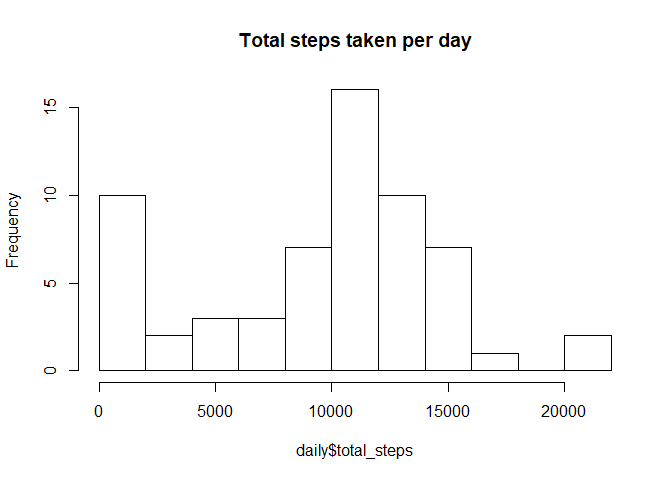
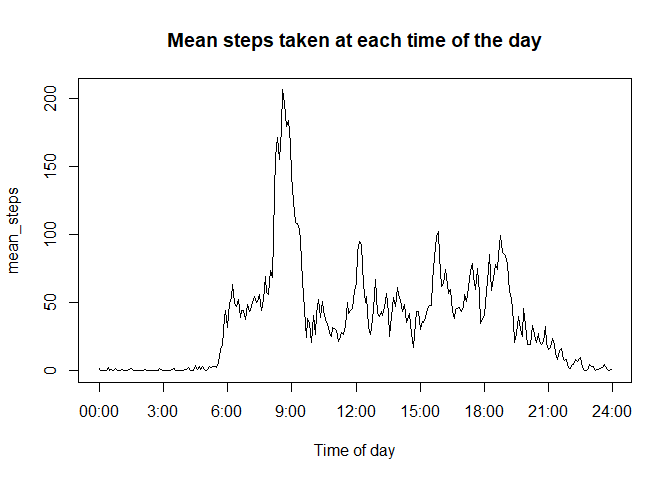
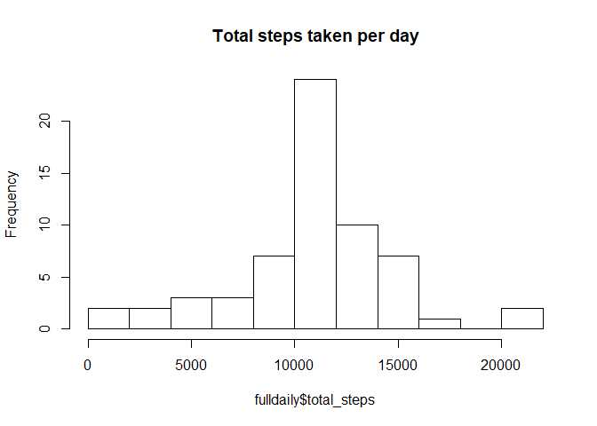
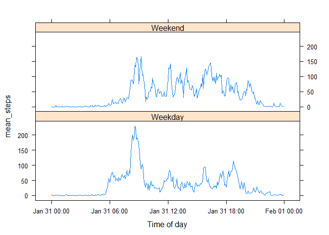

## Loading and preprocessing the data

### Loading

First, we unzip and read the data.
Note that because we're going to manipulate the data quite a bit, we might want to go back to our original data at some point, which is why I back up a copy before starting the  processing.


```r
uzf <- unzip("activity.zip")
activity_origin <-read.csv(uzf)
activity<- activity_origin
```

### Processing the date
We need to transform the table so that the date appears in a proper format.

```r
library(lubridate)
```

```
## 
## Attaching package: 'lubridate'
```

```
## The following object is masked from 'package:base':
## 
##     date
```

```r
activity$date <- ymd (as.character(activity$date))
```

### Processing the interval column as a time

The interval column can be a bit confusing: it's not really numeric, it's actually the clocktime, so that 5 should be 00:05, 100 should be 01:00, etc... 
In order to interpret it correctly, I made a function, makehour, which reads the value in interval and turns it into a properly displayed clocktime.


```r
makehour <- function(x) {
if (nchar(x) == 4)
        paste(substr(x, 1,2), substr(x,3,4), sep=":")
else if (nchar(x) == 3) {
                y<- paste0("0", x)
                y<-paste(substr(y, 1,2), substr(y,3,4), sep=":")
                y}
                
else if (nchar (x) == 2)
        paste("00", x, sep=":")

else if (nchar(x) ==1) {
        y<- paste0("0", x)
        y <- paste("00", y, sep=":")
        y}
else
        print ("wrong length")}
```

You can check a few examples below to see how makehour works:

```r
makehour("5")
```

```
## [1] "00:05"
```

```r
makehour("945")
```

```
## [1] "09:45"
```

Now that we have our transformation function, we add a column, clocktime, to our activity table.


```r
activity$interval <- as.character(activity$interval)

for (i in 1:17568){
activity$clocktime[i] <- makehour(activity$interval[i])}
```

This is what our activity table looks like after initial processing:

```r
head(activity)
```

```
##   steps       date interval clocktime
## 1    NA 2012-10-01        0     00:00
## 2    NA 2012-10-01        5     00:05
## 3    NA 2012-10-01       10     00:10
## 4    NA 2012-10-01       15     00:15
## 5    NA 2012-10-01       20     00:20
## 6    NA 2012-10-01       25     00:25
```


## What is mean total number of steps taken per day?

Answering this question requires grouping our data by day. For this, we are going to use the dplyr library, and its group_by and summarize functions:


```r
library(dplyr)
```

```
## 
## Attaching package: 'dplyr'
```

```
## The following objects are masked from 'package:lubridate':
## 
##     intersect, setdiff, union
```

```
## The following objects are masked from 'package:stats':
## 
##     filter, lag
```

```
## The following objects are masked from 'package:base':
## 
##     intersect, setdiff, setequal, union
```

```r
d_activity<-group_by(activity, date)
daily <- d_activity %>% select(steps, date) %>% summarize(total_steps=sum(steps, na.rm=TRUE))
daily
```

```
## # A tibble: 61 x 2
##    date       total_steps
##    <date>           <int>
##  1 2012-10-01           0
##  2 2012-10-02         126
##  3 2012-10-03       11352
##  4 2012-10-04       12116
##  5 2012-10-05       13294
##  6 2012-10-06       15420
##  7 2012-10-07       11015
##  8 2012-10-08           0
##  9 2012-10-09       12811
## 10 2012-10-10        9900
## # ... with 51 more rows
```

We see that we obtained a table that has just the number of steps taken each day, which we can use to make our histogram:

```r
hist(daily$total_steps, nclass= 10, main="Total steps taken per day")
```

<!-- -->

We can also directly calculate the mean and median number of steps per day from this summary table:

```r
mean(daily$total_steps)
```

```
## [1] 9354.23
```

```r
median(daily$total_steps)
```

```
## [1] 10395
```

We get a mean of 9354 and a median of 10395: The median is higher than the mean because there are quite a few days for which the value is 0.

## What is the average daily activity pattern?

We'll use the clocktime variable that we created in the preprocessing to answer this question. Once the table is grouped by factors representing each five minute interval, we can calculate the mean steps.

```r
activity_bytime <- group_by(activity, clocktime)
fiveminutesummary <- summarize(activity_bytime, mean_steps = mean(steps, na.rm = TRUE))
head(fiveminutesummary)
```

```
## # A tibble: 6 x 2
##   clocktime mean_steps
##   <chr>          <dbl>
## 1 00:00         1.72  
## 2 00:05         0.340 
## 3 00:10         0.132 
## 4 00:15         0.151 
## 5 00:20         0.0755
## 6 00:25         2.09
```

### Making the graph

We can't use our table as is to make the graph, because clocktime is a character vector. So we add a column to our graph which represents the time:

```r
library(lubridate)
fiveminutesummary$lubrihour <- hm(fiveminutesummary$clocktime)
with(fiveminutesummary, plot(lubrihour, mean_steps, type="l", xlab="Time of day", xaxt="n"))
axis(1, at=seq(from=0, to=24*3600, by=3*3600), labels=c("00:00","3:00", "6:00", "9:00", "12:00", "15:00", "18:00", "21:00", "24:00"))
title(main="Mean steps taken at each time of the day")
```

<!-- -->

### Which 5 minute interval contains the max number of steps?

From our graph, we can see that it's a bit before 9 am, so our result has to be coherent with that.

```r
which.max(fiveminutesummary$mean_steps)
```

```
## [1] 104
```

```r
fiveminutesummary$clocktime[104]
```

```
## [1] "08:35"
```

The answer, 8:35 am, fits with what the graph shows us.


## Imputing missing values

### Choosing the strategy

The total steps taken per day histogram showed that the distribution of frequencies per day was mostly normal, apart from a lot of really low values, which may coincide with a lot of missing data. The period of the day shows much more variance and a much more unpredictable pattern, so it would make sense to impute missing values based on the 5-minute interval, and not based on the day.

### Number and location of missing values


```r
sum(is.na(activity$steps))
```

```
## [1] 2304
```
There are 2304 missing values.

We also saw that there were a lot of days for which the number of steps was close to 0, which suggests missing values might be grouped. Let's look again at our d_activity table to confirm this:


```r
nasbyday <- summarize(d_activity, nas=sum(is.na(steps)))
with(nasbyday, table(date, nas))
```

```
##             nas
## date         0 288
##   2012-10-01 0   1
##   2012-10-02 1   0
##   2012-10-03 1   0
##   2012-10-04 1   0
##   2012-10-05 1   0
##   2012-10-06 1   0
##   2012-10-07 1   0
##   2012-10-08 0   1
##   2012-10-09 1   0
##   2012-10-10 1   0
##   2012-10-11 1   0
##   2012-10-12 1   0
##   2012-10-13 1   0
##   2012-10-14 1   0
##   2012-10-15 1   0
##   2012-10-16 1   0
##   2012-10-17 1   0
##   2012-10-18 1   0
##   2012-10-19 1   0
##   2012-10-20 1   0
##   2012-10-21 1   0
##   2012-10-22 1   0
##   2012-10-23 1   0
##   2012-10-24 1   0
##   2012-10-25 1   0
##   2012-10-26 1   0
##   2012-10-27 1   0
##   2012-10-28 1   0
##   2012-10-29 1   0
##   2012-10-30 1   0
##   2012-10-31 1   0
##   2012-11-01 0   1
##   2012-11-02 1   0
##   2012-11-03 1   0
##   2012-11-04 0   1
##   2012-11-05 1   0
##   2012-11-06 1   0
##   2012-11-07 1   0
##   2012-11-08 1   0
##   2012-11-09 0   1
##   2012-11-10 0   1
##   2012-11-11 1   0
##   2012-11-12 1   0
##   2012-11-13 1   0
##   2012-11-14 0   1
##   2012-11-15 1   0
##   2012-11-16 1   0
##   2012-11-17 1   0
##   2012-11-18 1   0
##   2012-11-19 1   0
##   2012-11-20 1   0
##   2012-11-21 1   0
##   2012-11-22 1   0
##   2012-11-23 1   0
##   2012-11-24 1   0
##   2012-11-25 1   0
##   2012-11-26 1   0
##   2012-11-27 1   0
##   2012-11-28 1   0
##   2012-11-29 1   0
##   2012-11-30 0   1
```

This confirms what we guessed above: there are 8 days in which all the values are missing, otherwise for the other days there are no missing values.

### Filling in the missing values:

Since we're imputing by the mean value for the 5 minute interval, we can thus separate our data into 2 tables, one with the days where the data is missing and one where it's there. Then we'll fill in the values calculated in the table fiveminutesummary for the missing days.

For this, we start by adding a column called daynumber which we'll use for splitting.


```r
missingdays <- with(nasbyday, which(nas>0))
activity_with_daynumbers <- activity
activity_with_daynumbers$daynumber <- rep(1:61, each=288)
```

Then we copy the values from our fiveminutesummary table into the missing days;

```r
missingvals <- subset(activity_with_daynumbers, daynumber %in% missingdays)
missingvals$steps <- rep(fiveminutesummary$mean_steps, 8)
```
Then we recombine this table with the values that were already filled in:

```r
notmissing <- subset(activity_with_daynumbers, !(daynumber %in% missingdays))
fullactivity <- rbind(missingvals, notmissing)
fullactivity <-  fullactivity[order(fullactivity$daynumber, fullactivity$clocktime),]
```

### New histogram


```r
d_full <- group_by(fullactivity, date)
fulldaily <- d_full %>% select(steps, date) %>% summarize(total_steps=sum(steps, na.rm=TRUE))
hist(fulldaily$total_steps, nclass= 10, main="Total steps taken per day")
```

<!-- -->

### New mean and median values


```r
mean(fulldaily$total_steps)
```

```
## [1] 10766.19
```

```r
median(fulldaily$total_steps)
```

```
## [1] 10766.19
```

We get a mean and a median of 10766.19; it may seem weird to have a mean and a median that are exactly the same, but that's because we have 8 days out of 61 for which the number of steps per day is exactly the mean of all days, so it makes sense that that would also be the median.
Imputing missing data has made the mean and median increase, and the variance has decreased.

## Are there differences in activity patterns between weekdays and weekends?

The first step when answering this kind of question in my case, working on a french computer, is to set system.time to english for readability.


```r
Sys.setlocale("LC_TIME","English")
```

```
## [1] "English_United States.1252"
```

Then we'll add a variable with the weekday value.

```r
weekpattern <- fullactivity
weekpattern$dayname <- weekdays(weekpattern$date)
```

Then we add another column, called daytype, which tells us if it's in the weekend or not.

```r
weekpattern$daytype = rep("", 17568)

for (i in 1:17568){
        if (weekpattern$dayname[i] %in% c("Saturday","Sunday"))
                weekpattern$daytype[i] ="Weekend"
        else 
                weekpattern$daytype[i] ="Weekday"}
```
Now we make a table similar to fiveminnutesummary, but with an additional level for the groups, and use this summary table to make a time series graph:


```r
patternperiods <- group_by(weekpattern, daytype, clocktime)
patternsummary <- summarize(patternperiods, mean_steps = mean(steps))
patternsummary$properclock <- strptime(patternsummary$clocktime, format="%H:%M")
library(lattice)
xyplot(mean_steps~as.POSIXct(properclock)| daytype, data=patternsummary, type="l", layout=c(1,2),
       xlab = "Time of day")
```

<!-- -->

*Note: Please ignore the dates in the labels of the x axis: I couldn't get the graph to work with lattice or ggplot2 using the time class from lubridate, and the POSIXct function sticks today's date in front of the time. I thought that keeping the clock time rather than a numeric value was still better.*
